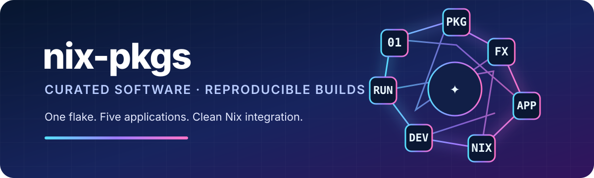

<p align="center">
  
</p>

<p align="center">
  Direct Nix commands for the maintained repositories. This repository is documentation only and is not a Flake or package mirror.
</p>

## Why direct repositories?

Every project owns its package, checks, Flake outputs, lock file, and optional NixOS modules. A commit on a project's default branch is therefore available directly without waiting for a second catalog repository.

The normal local update command is:

```bash
nix profile upgrade --all --refresh
```

## Packages

| Package | Repository | Run directly |
|---|---|---|
| TwintailLauncher | [`madebycli/twintail-nix`](https://github.com/madebycli/twintail-nix) | `nix run github:madebycli/twintail-nix#twintaillauncher` |
| Helium | [`madebycli/helium-nix`](https://github.com/madebycli/helium-nix) | `nix run github:madebycli/helium-nix#helium` |
| Sakura | [`madebycli/sakura`](https://github.com/madebycli/sakura) | `nix run github:madebycli/sakura#sakura` |
| Pipes | [`madebycli/Pipes`](https://github.com/madebycli/Pipes) | `nix run github:madebycli/Pipes#pipes` |
| GIF Player | [`madebycli/GIF-Player`](https://github.com/madebycli/GIF-Player) | `nix run github:madebycli/GIF-Player#gif-player` |
| GitHub Backup Deck | [`madebycli/git-backup`](https://github.com/madebycli/git-backup) | `nix run github:madebycli/git-backup#github-backup-deck` |

## Install into a Nix profile

```bash
nix profile add github:madebycli/twintail-nix#twintaillauncher
nix profile add github:madebycli/helium-nix#helium
nix profile add github:madebycli/sakura#sakura
nix profile add github:madebycli/Pipes#pipes
nix profile add github:madebycli/GIF-Player#gif-player
nix profile add github:madebycli/git-backup#github-backup-deck
```

Refresh every installed profile package:

```bash
nix profile upgrade --all --refresh
```

Inspect or remove profile entries:

```bash
nix profile list
nix profile remove <profile-name-or-index>
```

Packages previously installed through `github:madebycli/nix-pkgs` should be removed once and added again with the direct repository command above.

## What updates automatically?

There are three independent update layers.

### 1. Project source code

Sakura, Pipes, GIF Player, and GitHub Backup Deck package the source from their own repository. A normal commit to `main` changes the package source immediately, even when the application version string is unchanged. No Nix file, package version, catalog pin, or extra release commit is required.

After the commit is on `main`, run:

```bash
nix profile upgrade --all --refresh
```

The same rule applies to changes in the Nix packaging code of TwintailLauncher and Helium. Their external application payloads are handled separately as described below.

### 2. Nixpkgs and build dependencies

Every project commits a `flake.lock`. The lock file makes an installation reproducible and prevents an untested dependency update from breaking users unexpectedly.

A committed lock file does not update itself on the user's computer. Each repository therefore has an **Update Nixpkgs input** workflow that:

- runs automatically once per day;
- can be started manually with **Run workflow**;
- updates the `nixpkgs` lock to the current `nixos-unstable` revision;
- evaluates the Flake, runs its checks, and builds the package;
- commits the new lock file only after validation succeeds.

This means a future installation uses the newest dependency set that the repository has successfully validated. It does not remain permanently tied to today's dependencies while the repository automation is active.

“Newest dependencies” means the newest versions currently packaged and successfully evaluated in `nixos-unstable`. It does not guarantee that every individual upstream library is at its absolute newest release on the same day.

A repository that is abandoned, archived, or has Actions disabled remains pinned to its last validated lock file. This is intentional reproducibility rather than silent dependency drift.

### 3. External application releases

TwintailLauncher and Helium package external upstream releases. Their **Update upstream release** workflows:

- check automatically once per day;
- remain manually startable;
- validate the new upstream source and package before committing an update.

A new upstream release becomes available through the direct repository after that validated updater commit.

## Five-year behavior

Installing from an unlocked repository reference such as:

```bash
nix profile add github:madebycli/sakura#sakura
```

selects the current `main` commit of that repository. The package source is therefore the current source, and its dependencies are the versions recorded in the current validated `flake.lock`.

Running this later:

```bash
nix profile upgrade --all --refresh
```

fetches the newest repository commits for profile entries installed through unlocked references. It then uses the lock files contained in those newest commits.

Therefore, after five years:

- current project source comes from the current repository `main`;
- Nixpkgs comes from the latest lock update that successfully passed the repository's automated tests;
- Helium and TwintailLauncher use the latest upstream release their updater successfully validated;
- no manual edit to `flake.nix`, `package.nix`, or `flake.lock` is expected during normal maintenance.

Do not install using an explicit commit SHA when future upgrades are desired. A URL containing a fixed commit is intentionally immutable.

## Direct-install verification

Every project CI now tests its exact public profile command against the GitHub repository, for example:

```bash
nix profile add github:madebycli/git-backup#github-backup-deck
```

The CI also verifies that `nix flake lock` produces no uncommitted lock-file changes. A missing or stale lock file therefore fails CI instead of reaching users unnoticed.

## Use directly in a NixOS Flake

Add only the repositories that the system actually uses:

```nix
{
  inputs = {
    nixpkgs.url = "github:NixOS/nixpkgs/nixos-unstable";

    twintail-nix.url = "github:madebycli/twintail-nix";
    helium-nix.url = "github:madebycli/helium-nix";
    sakura.url = "github:madebycli/sakura";
    pipes.url = "github:madebycli/Pipes";
    gif-player.url = "github:madebycli/GIF-Player";
    git-backup.url = "github:madebycli/git-backup";

    twintail-nix.inputs.nixpkgs.follows = "nixpkgs";
    helium-nix.inputs.nixpkgs.follows = "nixpkgs";
    sakura.inputs.nixpkgs.follows = "nixpkgs";
    pipes.inputs.nixpkgs.follows = "nixpkgs";
    gif-player.inputs.nixpkgs.follows = "nixpkgs";
    git-backup.inputs.nixpkgs.follows = "nixpkgs";
  };
}
```

Use their package outputs directly:

```nix
{ inputs, pkgs, ... }:
{
  environment.systemPackages = [
    inputs.twintail-nix.packages.${pkgs.system}.twintaillauncher
    inputs.helium-nix.packages.${pkgs.system}.helium
    inputs.sakura.packages.${pkgs.system}.sakura
    inputs.pipes.packages.${pkgs.system}.pipes
    inputs.gif-player.packages.${pkgs.system}.gif-player
    inputs.git-backup.packages.${pkgs.system}.github-backup-deck
  ];
}
```

## NixOS and Home Manager modules

TwintailLauncher exposes its NixOS module directly:

```nix
{
  imports = [ inputs.twintail-nix.nixosModules.default ];
  programs.twintaillauncher.enable = true;
}
```

GitHub Backup Deck exposes both NixOS and Home Manager modules directly:

```nix
{
  imports = [ inputs.git-backup.nixosModules.default ];
}
```

```nix
{
  imports = [ inputs.git-backup.homeManagerModules.default ];
}
```

For Sakura, Pipes, GIF Player, and Helium, use the package output directly unless their repository later adds a dedicated module.

## Archived full catalog

The former combined Flake catalog is preserved unchanged on the branch [`archive/full-catalog-2026-08-06`](https://github.com/madebycli/nix-pkgs/tree/archive/full-catalog-2026-08-06).

That branch points to commit `88775d2535465dc8e837541eafa921b1c75a99ca` and contains the previous `flake.nix`, `flake.lock`, package re-exports, overlay, module re-export, CI, and catalog-update workflow. It is a historical backup only and is not maintained.

Clone only the archived catalog:

```bash
git clone --branch archive/full-catalog-2026-08-06 --single-branch \
  https://github.com/madebycli/nix-pkgs.git nix-pkgs-full-catalog-backup
```

## Repository role

`madebycli/nix-pkgs` on `main` is intentionally only an index and command reference. The individual repositories are the sole source of truth. The archived branch exists only as a rollback and reference snapshot.
